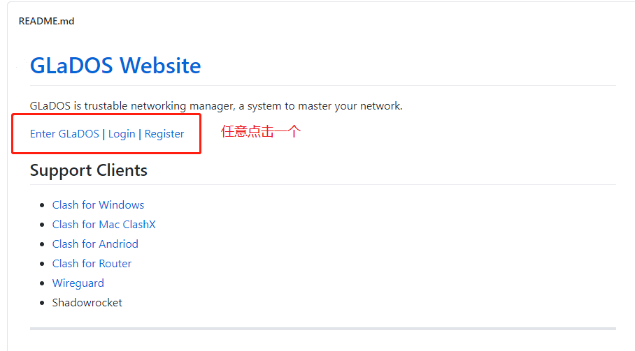
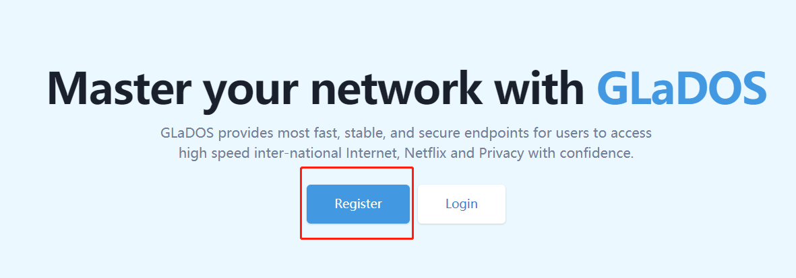
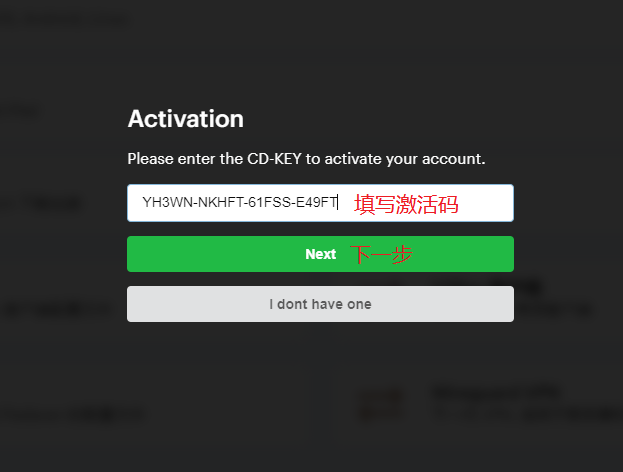
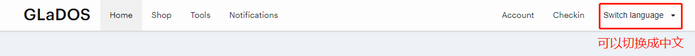

# GladosCheckIn
GLaDOS每日签到
每天自动签到（前30天+1，之后33%概率+1?），使用server酱通过公众号推送结果

## 使用说明

### 一、Fork此仓库

  

### 二、设置密钥
SCKEY serve酱的sckey
COOKIE 账号的cookie

### 三、启用Action
1 点击Action，再点击I understand my workflows, go ahead and enable them

### 四、查看运行结果

## GLaDOS注册（一开始送3天）  
#### 注册链接：https://github.com/glados-network/GLaDOS  
  

  

  

#### 填写激活码 YH3WN-NKHFT-61FSS-E49FT  

  

  

#### 根据自己的需求选择，点击会跳转到向导页面。
