# GLaDOS 每日签到💮

- 基于 [Github Actions](https://github.com/features/actions)
- 每天北京时间 **9点30分**（[UTC时间](https://datetime360.com/cn/utc-beijing-time/) 1点30分）进行自动签到
  - 实际上通常会延迟，但不会太久，庆幸的是大多情况下我们并不关心是否准时
- 可用 [pushplus(推送加)](https://www.pushplus.plus/) 通过公众号推送结果

  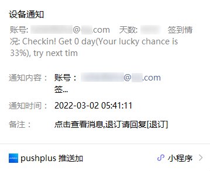

  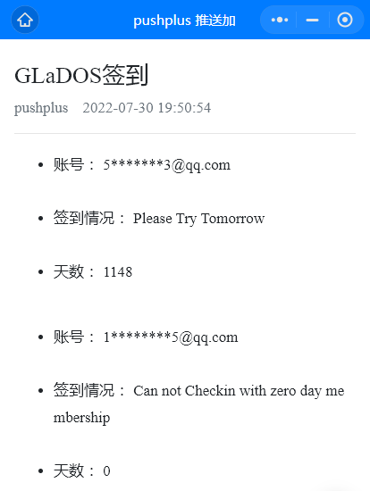

- [更新日志](#更新日志)

- [Discuss on GitHub](https://github.com/DullSword/GLaDOS-CheckIn/discussions)

## GLaDOS

>GLaDOS为用户提供最快速，稳定和安全的端点，使他们充满信心地访问高速国际互联网、Netflix和隐私。

我只用来冲冲浪🏄，到目前为止，感觉挺不错的，而且它有说对教育免费开放的，这一点让我觉得很良心，不过我并没享受到🍋。

[GLaDOS 项目地址](https://github.com/glados-network/GLaDOS)

[GLaDOS 注册教程](https://dullsword.github.io/2020/11/26/GLaDOS-%E6%B3%A8%E5%86%8C%E6%95%99%E7%A8%8B/)

## 代码说明

[Github Actions GLaDOS自动签到](https://dullsword.github.io/2020/11/20/Github-Actions-GLaDOS%E8%87%AA%E5%8A%A8%E7%AD%BE%E5%88%B0/)

## 使用说明

### 一、准备工作

- 账号的 cookie（并非仅此单一获取方式）

  1. 打开 GLaDos 并登陆，在首页往下拉，找到 **我的会员 > 会员签到**

     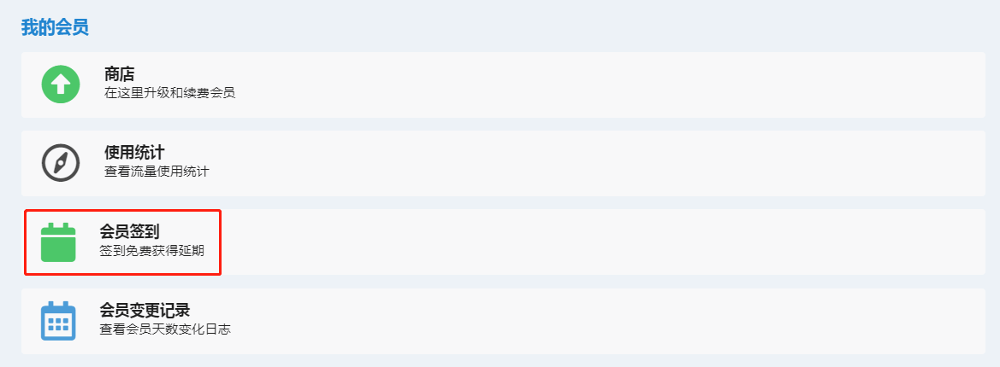

  2. 点击跳转到签到页面

     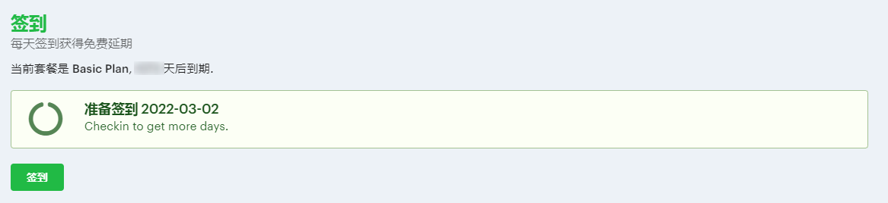

  3. 打开 "开发者工具"，通常快捷键为 **F12**，或是点击 **浏览器选项 > 更多工具 > 开发者工具**，打开后如图所示点击 "**network**" 标签

     

  4. 在签到页面点击签到，相对应的开发者工具 **network** 标签下会出现 "**checkin**" 请求，点击该请求，会出现更多信息，找到 "**Request Headers**" 里的 "**cookie**"，接下来设置密钥时需要用到

     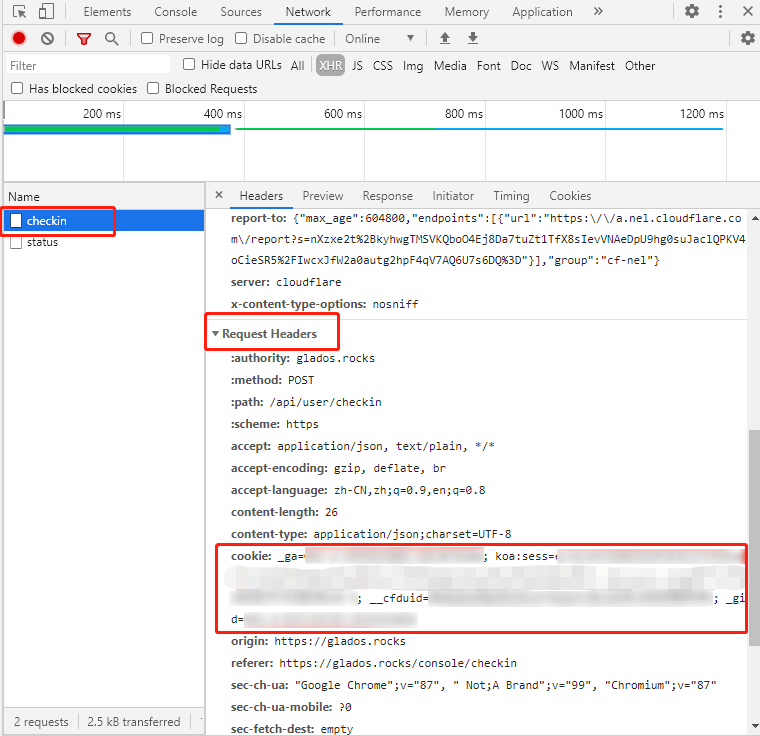

- pushplus 的 token（不需要推送功能，可以跳过）

  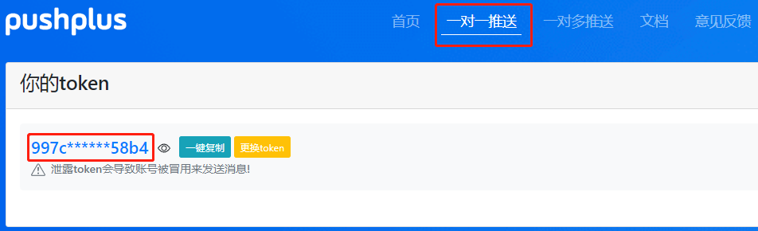

### 二、Fork此仓库

点击仓库右上角的 Fork

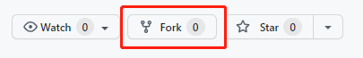

**注意：接下来的步骤都是在你自己 fork 后的仓库下进行操作.**

### 三、设置密钥

- `COOKIES`：账号的 cookie（第一步准备工作中所找到的 cookie）
  - 单账号：直接填写

    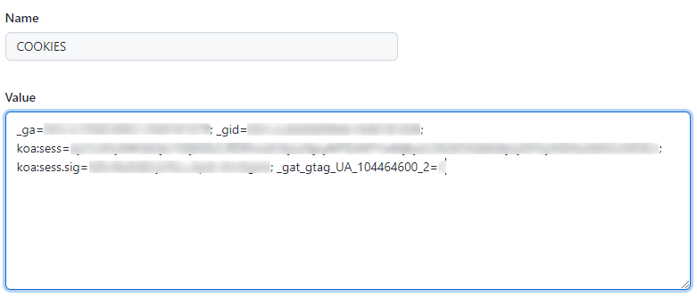

  - 多账号：每个 cookie 用 `&&` 隔开

    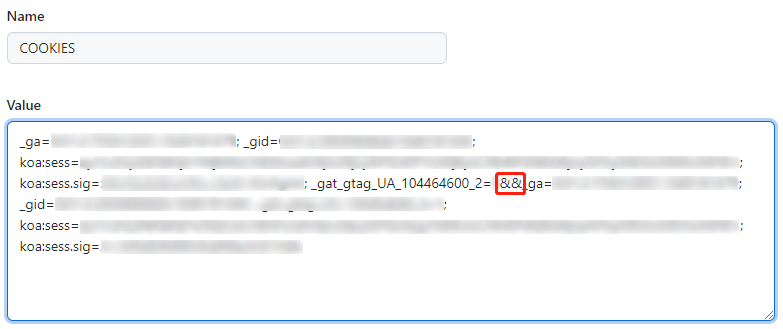

- `PUSHPLUS`：pushplus 的 token（不需要推送功能，可以不创建）

  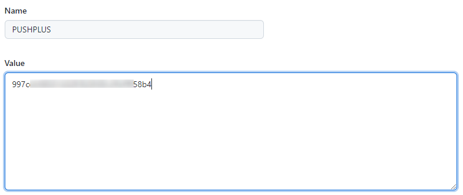

**注意：密钥名 COOKIES 和 PUSHPLUS，两者的所有字母都是大写.**

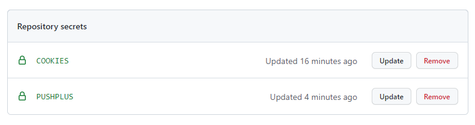

### 四、启用Action

1. 点击 Actions，再点击 "I understand my workflows, go ahead and enable them"

   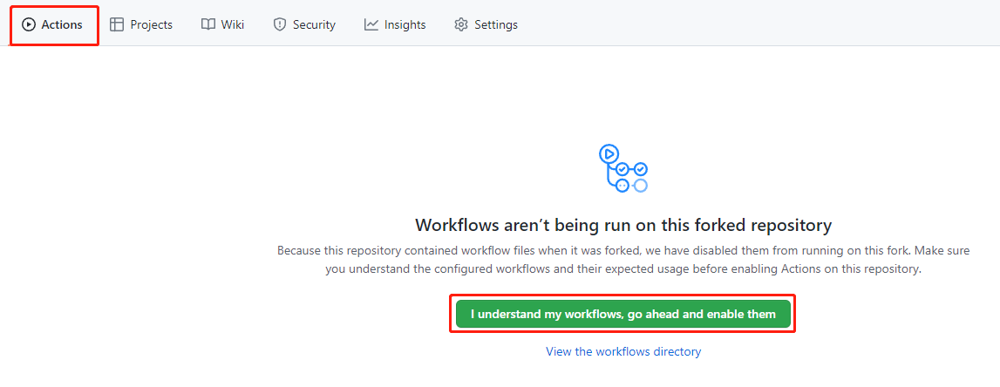

2. 点击仓库（你自己的）右上角的 Star

   

### 五、查看运行结果

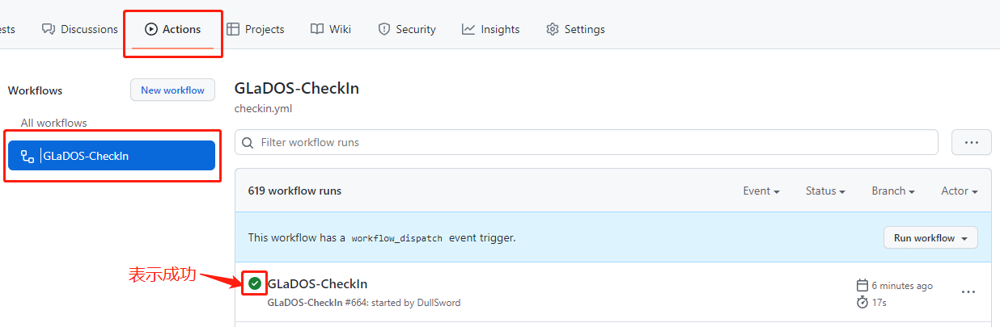

## 修改定时

1. 打开 .github/workflows/checkin.yml

   

2. 修改 [crontab](https://zh.wikipedia.org/wiki/Cron) 表达式

   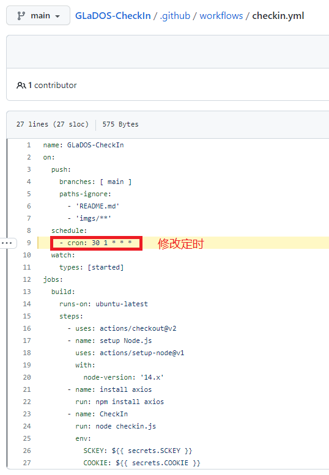

## 更新日志

### [2.0.0] - 2022-03-10

主分支更新为新版本，旧版本归入v1分支

#### 变更

- 推送平台由 [Server酱](https://sc.ftqq.com/) 更改为 [pushplus(推送加)](https://www.pushplus.plus/)
  - 当前推送消息标题需要显示主账号邮箱、天数、签到情况等信息，而 Server酱 消息标题的最大长度为32，有点捉襟见肘
  - pushplus 支持可视化展示 json 格式内容
  - pushplus 接口限制更少

#### 新增

- 多账号签到
  - 之前fork了旧版本，未改动的话：
    - 更新文件：选择 Fetch upstream 并点击 Fetch and merge 同步新版本

      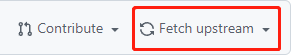

    - 更新密钥：删除 `SCKEY` ，新增 `PUSHPLUS`；删除 `COOKIE` ，新增 `COOKIES`. 详情见 [三、设置密钥](#三设置密钥)

## Star⭐

**觉得还不错的话，可以给我点一下 Star⭐.**
