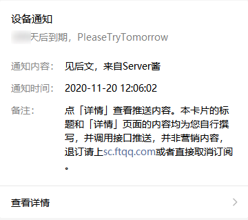
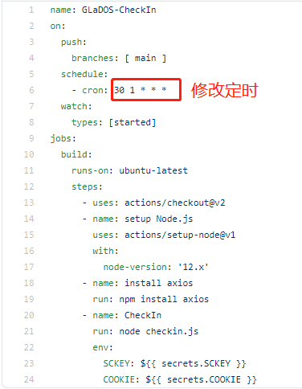

# GLaDOS 每日签到

* #### 每天早上9点30分自动签到
* #### 可用server酱通过公众号推送结果

## GLaDOS
>GLaDOS为用户提供最快速，稳定和安全的端点，使他们充满信心地访问高速国际互联网、Netflix和隐私。

到目前为止，感觉挺不错的，而且它是对教育免费开放的，这一点很良心。

[GLaDOS项目地址](https://github.com/glados-network/GLaDOS)

[GLaDOS注册教程](https://blog.csdn.net/qq_38523017/article/details/109854128)

## 代码说明💻
[Github Actions GLaDOS自动签到](https://blog.csdn.net/qq_38523017/article/details/109855848)

## 使用说明💡

### 一、准备工作
* #### serve酱的sckey（不需要可以跳过）

* #### 账号的cookie（并非仅此单一获取方式）
    *  打开GLaDos并登陆，找到右上角“签到”跳转到签到页面
    
    *  打开“开发者工具”，通常快捷键为F12，或是点击浏览器选项-更多工具-开发者工具，点击“network”标签
    
    *  此时点击签到，会出现“checkin”请求，点击该请求，会出现更多信息，找到“Request Headers”里的“cookie”，接下来需要用到
    

### 二、Fork此仓库🍴
###### 注意：接下来的步骤都是在你自己fork后的仓库下进行操作

### 三、设置密钥🔑
* #### SCKEY serve酱的sckey（不需要可以不创建或不设置）

* #### COOKIE 账号的cookie

### 四、启用Action🖱
#### 1. 点击Actions，再点击I understand my workflows, go ahead and enable them

#### 2. 点击仓库（你自己的）右上角的Star⭐或修改除imgs文件夹和README.md以外的内容并进行Push⬆

### 五、查看运行结果🔎

## 修改定时🕤
#### 1. 打开.github/workflows/checkin.yml
#### 2. 修改crontab表达式

## Star⭐
#### 觉得还不错的话，可以给我点一下Star⭐

