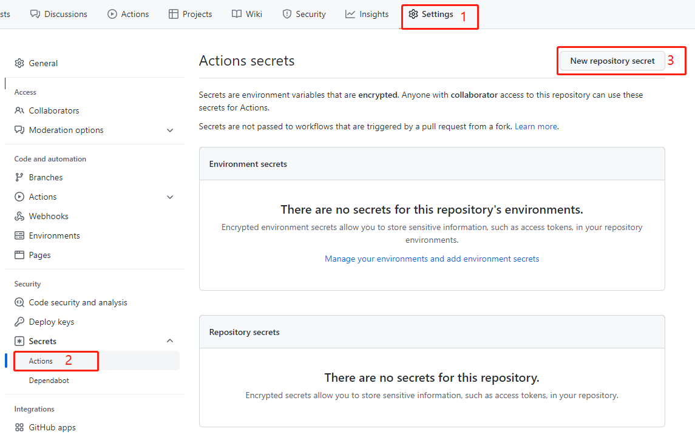

# GladosCheckIn
GLaDOS每日签到

每天早上9点30分自动签到，使用server酱通过公众号推送结果

## 使用说明

### 一、Fork此仓库

### 二、设置密钥
SCKEY serve酱的sckey

COOKIE 账号的cookie

### 三、启用Action
点击Action，再点击I understand my workflows, go ahead and enable them

### 四、查看运行结果（早上9点30分才会运行）

# 修改定时
#### 1. 打开.github/workflows/checkin.yml
#### 2. 修改crontab表达式

